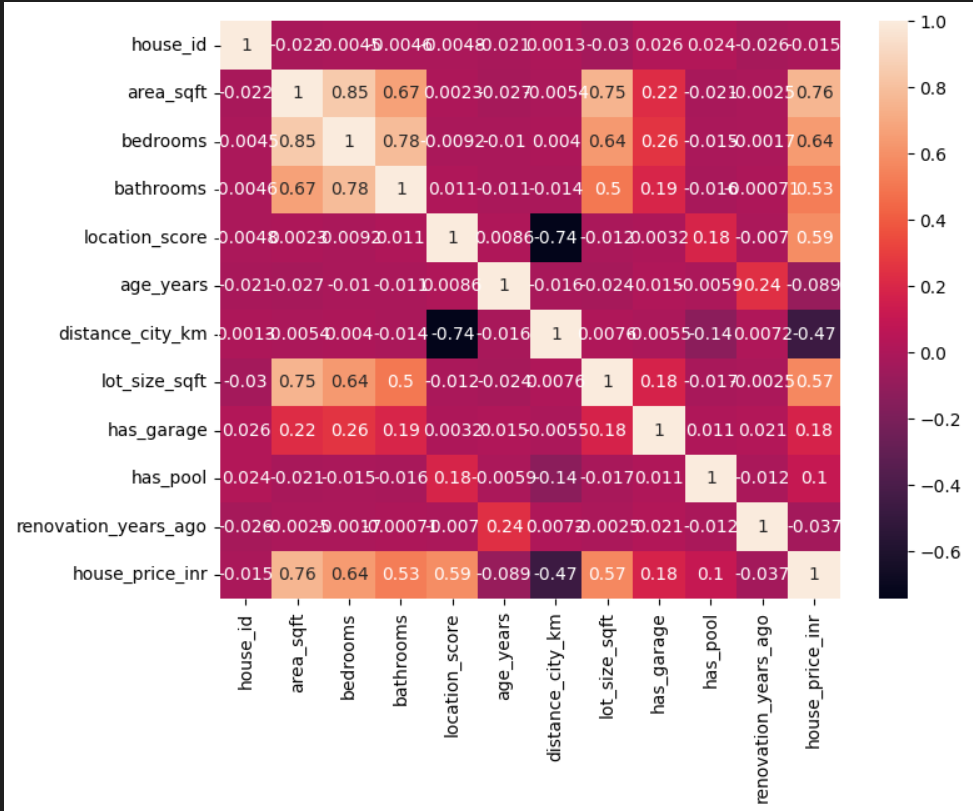
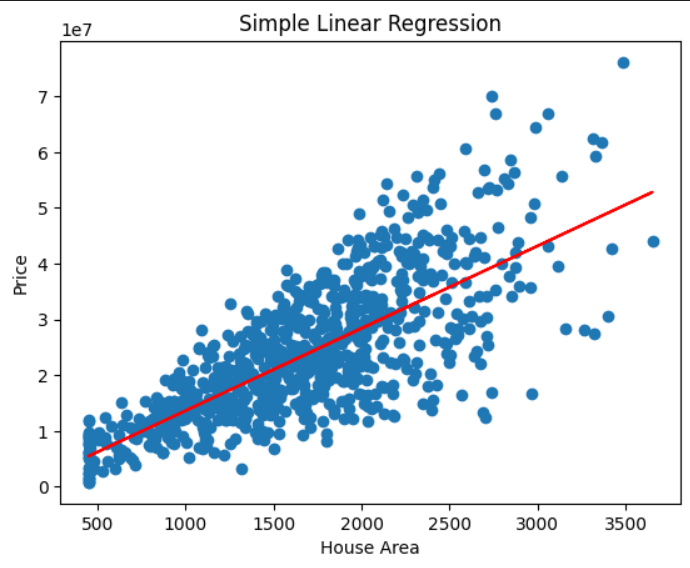
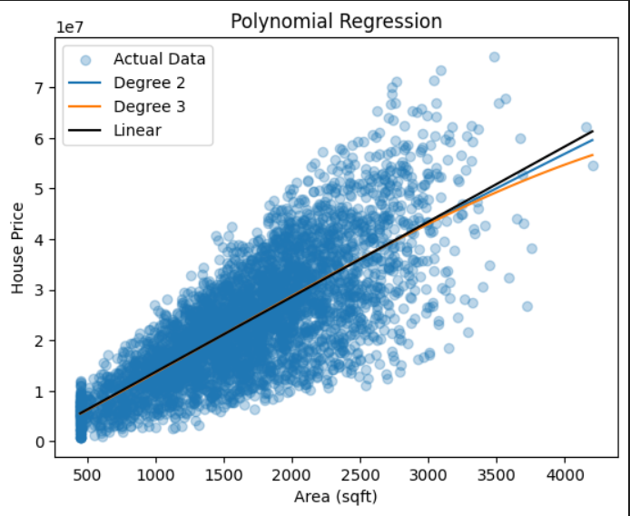
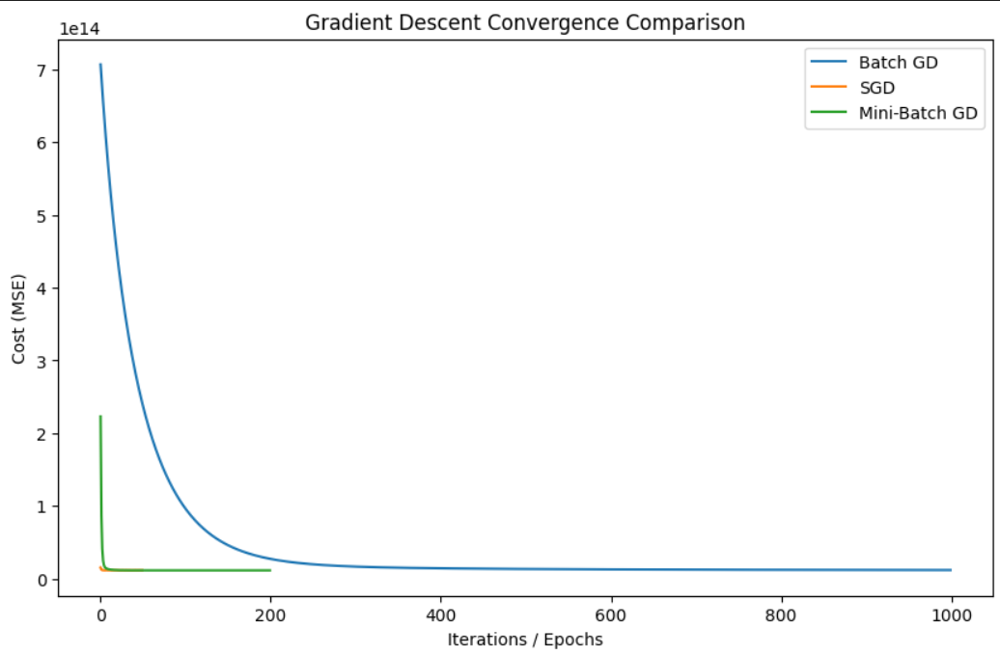

<div align="center">

# 🏠 House Price Prediction
### *A Complete Machine Learning Pipeline using Supervised Learning*


> 🎯 Predicting real estate house prices in INR using **Simple Linear Regression**, **Multiple Linear Regression**, and **Polynomial Regression** — with in-depth analysis of Bias-Variance Tradeoff, Gradient Descent, and Feature Correlation.

</div>

---

## 📌 Table of Contents

- [📖 Project Overview](#-project-overview)
- [📁 Project Structure](#-project-structure)
- [📊 Dataset](#-dataset)
- [🔬 Methodology](#-methodology)
- [📈 Visual Results](#-visual-results)
- [🧠 Key Concepts Covered](#-key-concepts-covered)
- [⚙️ Installation & Usage](#️-installation--usage)
- [📉 Model Performance](#-model-performance)
- [🤝 Contributing](#-contributing)

---

## 📖 Project Overview

This project builds an end-to-end **House Price Prediction** system using classic supervised machine learning regression techniques. The dataset contains **4200 real estate records** with features like area, bedrooms, location score, distance to city, and more.

The project covers the **full ML pipeline**:
- 🔍 Exploratory Data Analysis (EDA)
- 📐 Feature Engineering & Correlation Analysis
- 🤖 Model Building (Simple, Multiple & Polynomial Regression)
- ⚡ Gradient Descent (Batch, SGD, Mini-Batch)
- 📊 Bias-Variance Tradeoff Analysis
- 📏 Model Evaluation (R², MSE, RMSE)

---

## 📁 Project Structure

```
🏠 House-Price-Prediction/
│
├── 📓 House_Price_Prediction.ipynb     ← Main Jupyter Notebook
├── 📊 RealEstate_HousePrice_Dataset_4200.csv  ← Dataset
├── 🖼️ images/
│   ├── slr.png                         ← Simple Linear Regression Plot
│   ├── corr.png                        ← Correlation Heatmap
│   ├── GD.png                          ← Gradient Descent Convergence
│   ├── pr.png                          ← Polynomial Regression Plot
│   └── biasvariance.png                ← Bias-Variance Tradeoff Chart
└── 📄 README.md
```

---

## 📊 Dataset

| 📋 Property | 📌 Detail |
|-------------|-----------|
| **File** | `RealEstate_HousePrice_Dataset_4200.csv` |
| **Records** | 4,200 houses |
| **Target** | `house_price_inr` |
| **Features** | 11 input features |

### 🔑 Features at a Glance

| Feature | Description |
|---------|-------------|
| `area_sqft` | Total area of the house in sq. ft. |
| `bedrooms` | Number of bedrooms |
| `bathrooms` | Number of bathrooms |
| `location_score` | Desirability score of location (0–10) |
| `age_years` | Age of the property in years |
| `distance_city_km` | Distance from city center (km) |
| `lot_size_sqft` | Size of the lot in sq. ft. |
| `has_garage` | Garage availability (0/1) |
| `has_pool` | Pool availability (0/1) |
| `renovation_years_ago` | Years since last renovation |
| `house_price_inr` | 🎯 **Target** — House price in INR |

---

## 🔬 Methodology

```
📥 Load Data
    ↓
🔍 EDA & Correlation Analysis
    ↓
🧹 Data Preprocessing & Feature Selection
    ↓
✂️ Train / Test Split (80:20)
    ↓
🤖 Model Training
  ├── Simple Linear Regression  (area_sqft → price)
  ├── Multiple Linear Regression (all features)
  └── Polynomial Regression      (degree 2 & 3)
    ↓
⚡ Gradient Descent (Batch | SGD | Mini-Batch)
    ↓
📊 Evaluation (R², MSE, RMSE)
    ↓
📈 Bias-Variance Tradeoff Analysis
```

---

## 📈 Visual Results

### 🔗 Correlation Heatmap
> Understanding which features influence house price the most.



**🔑 Key Findings:**
- `area_sqft` → strongest positive correlation with price (0.76)
- `bedrooms` and `lot_size_sqft` also highly correlated
- `distance_city_km` has a negative impact (-0.47) — farther from city = lower price
- `location_score` positively impacts price (0.59)

---

### 📏 Simple Linear Regression
> Predicting house price using only `area_sqft`.



- R² Score ≈ **0.57** — moderate fit
- Captures the general upward trend but misses complex patterns

---

### 🌀 Polynomial Regression
> Fitting degree-2 and degree-3 curves for better accuracy.



- Degree 2 and Degree 3 curves closely track the data distribution
- Outperforms simple linear regression significantly

---

### ⚡ Gradient Descent Convergence
> Comparing how fast Batch GD, SGD, and Mini-Batch GD converge.



| Algorithm | Convergence Speed | Stability |
|-----------|:-----------------:|:---------:|
| Batch GD | 🐢 Slow | ✅ Very Stable |
| SGD | ⚡ Fastest | ⚠️ Noisy |
| Mini-Batch GD | 🚀 Fast | ✅ Balanced |

---

### ⚖️ Bias-Variance Tradeoff
> Evaluating model complexity vs. performance.


| Model | Train R² | Test R² |
|-------|:--------:|:-------:|
| Simple Linear | ~0.57 | ~0.56 |
| Multiple Linear | ~0.92 | ~0.92 |
| Polynomial | ~0.97 | ~0.97 |

> ✅ **Polynomial Regression** achieves the best performance with no signs of overfitting — train and test scores remain nearly equal.

---

## 🧠 Key Concepts Covered

| Concept | Description |
|---------|-------------|
| 📐 **Simple Linear Regression** | y = mx + c — one feature predicts price |
| 🔢 **Multiple Linear Regression** | Uses all features simultaneously |
| 🌀 **Polynomial Regression** | Non-linear fitting using degree 2 & 3 |
| ⚡ **Gradient Descent** | Optimization via Batch, SGD, Mini-Batch |
| ⚖️ **Bias-Variance Tradeoff** | Balance between underfitting and overfitting |
| 📊 **Correlation Analysis** | Heatmap of feature-feature & feature-target relationships |
| 📏 **Model Evaluation** | R², MSE, RMSE metrics |

---

## ⚙️ Installation & Usage

### 1️⃣ Clone the Repository
```bash
git clone https://github.com/your-username/house-price-prediction.git
cd house-price-prediction
```

### 2️⃣ Install Dependencies
```bash
pip install numpy pandas matplotlib seaborn scikit-learn jupyter
```

### 3️⃣ Launch the Notebook
```bash
jupyter notebook House_Price_Prediction.ipynb
```

---

## 📉 Model Performance Summary

| 🤖 Model | 📐 Train R² | 🧪 Test R² | 📉 MSE |
|----------|:-----------:|:----------:|:------:|
| Simple Linear Regression | 0.574 | 0.562 | High |
| Multiple Linear Regression | 0.924 | 0.920 | Medium |
| Polynomial Regression (Deg 2/3) | 0.968 | 0.965 | Low ✅ |

> 🏆 **Best Model:** Polynomial Regression — highest R² with balanced train/test performance

---

<div align="center">

Made with ❤️ and 🐍 Python

</div>
